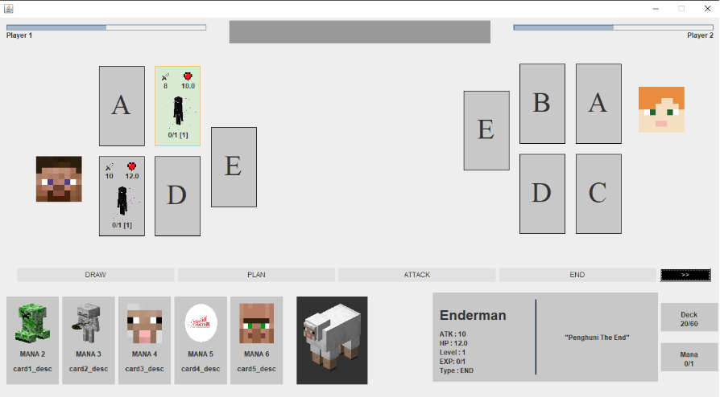

# IF2210 Minecraft Aether Wars

## Struktur Progran
```
.
└── Minecraft-Aether-Realm/
    ├── src/
    │   ├── main/
    │   │   ├── java/com/aetherwars/
    │   │   │   ├── GUI/
    │   │   │   │   ├── Components
    │   │   │   │   └── GUI.java
    │   │   │   ├── card/
    │   │   │   │   ├── Character
    │   │   │   │   ├── Spell
    │   │   │   │   ├── Card.java
    │   │   │   │   ├── Deck.java
    │   │   │   │   ├── Summonable.java
    │   │   │   │   └── Summoned.java
    │   │   │   ├── controller/
    │   │   │   │   └── BoardController.java
    │   │   │   ├── event
    │   │   │   ├── model/
    │   │   │   │   ├── Phase.java
    │   │   │   │   └── Player.java
    │   │   │   ├── util/
    │   │   │   │   └── CSVReader.java
    │   │   │   ├── view/
    │   │   │   │   └── Frame.java
    │   │   │   ├── AetherWars.java
    │   │   │   └── Game.java
    │   │   └── resources/com/aetherwars/card/
    │   │       ├── data/
    │   │       │   ├── character.csv
    │   │       │   ├── spell_morph.csv
    │   │       │   ├── spell_ptn.csv
    │   │       │   └── spell_swap.csv
    │   │       └── image/
    │   │           ├── Player
    │   │           ├── character
    │   │           ├── icon
    │   │           └── spell/
    │   │               ├── morph
    │   │               ├── potion
    │   │               └── swap
    │   └── test/java/com/aetherwars/card/
    │       ├── spell/
    │       │   └── LevelSpellTest.java
    │       └── SummonedCharacterTest.java
    └── README.md
```
## Cara Compile dan Menjalankan Program
Untuk melakukan kompilasi buka terminal lalu menuju folder root dari 
aplikasi ini, kemudian tuliskan:

`./gradlew run`

## Screenshot Program



## Credit

Minecraft images and description are taken from [Minecraft Wikia](https://minecraft.fandom.com/wiki/)
Other sources for "random" images are:

- Album Supporteran STEI 2018 :D
- https://mobile.twitter.com/masterlimbad6
- https://www.nationalgeographic.com/science/article/141104-kamikaze-kublai-khan-winds-typhoon-japan-invasion
- https://open.spotify.com/album/3GzwPyPZCyrqUTaurTaS23
- https://cdn.wccftech.com/wp-content/uploads/2021/06/nvidia-geforce-rtx-3080-ti-product-gallery-photo-003-scaled.jpg
- https://twitter.com/GGumiliar
- https://dota2.fandom.com/wiki/Spectre
